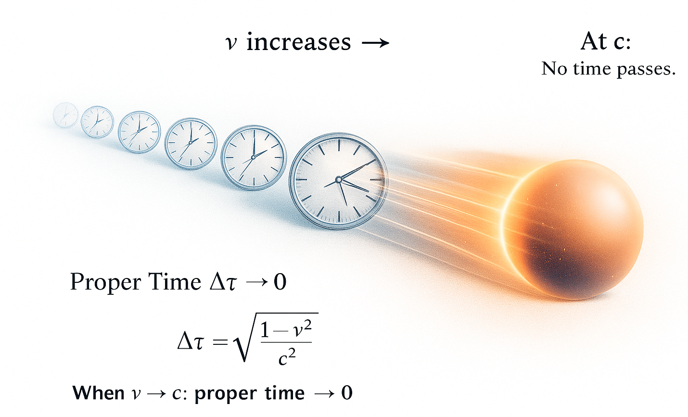

Image Created with IA colaboration.

# 🌌 GRAVITY IS THE 4TH DIMENSION     #
## Pedro Miguel Borges             #

> *“Gravity is the 4th Dimension.”*  
> *“The gravity curve is the 4th Dimension.”*
 
These two sentences are the key to understanding the entire model. 
Everything else — from redshift to horizons to black holes — follows naturally from this geometric interpretation of the Universe. 
 

*(CLINK ON IMAGE FOR YOUTUBE LINK)*

---

# 📄 Download the Full Document (Version 9)

➡️ **[Gravity_as_the_4th_Spatial_Dimension.pdf](https://github.com/pmborg/Gravity-is-the-4th-Dimension/blob/main/build/GravityV9.pdf)**  
*(Complete version with Appendix A: Mathematical Foundations)*

---

# 📘 Overview

This project presents a **geometric, physical, and intuitive** model of the Universe:

- The Universe is a **3D hypersurface** embedded in a **4D spatial manifold**.  
- Gravity is **extrinsic curvature** (bending into the 4th spatial dimension).  
- Time is **not geometric** — it is the internal evolution of matter.  
- What cosmology calls **expansion** corresponds in G4D to geometric motion through the embedding dimension:  
- No singularities, no dark energy, no inflation.  
- GR’s equations emerge naturally from Gauss–Codazzi projection.

This interpretation preserves all predictions of GR while removing conceptual paradoxes.

---

# 📚 Table of Contents

1. Introduction  
2. Relational Time  
3. 3D Hypersurface in 4D Space  
4. Extrinsic Curvature as Gravity  
5. Cosmology Without Singularities  
6. Predictions & Observational Tests  
7. Comparison with General Relativity  
8. Conclusion  
9. Appendix A – Mathematical Foundations  

---

# G4D — Fundamental View

G4D is built on nine CORE PRINCIPLES.
Below is the foundational interpretation of the theory.

G4D does **not** propose a different mathematical universe from General Relativity.

It proposes a different **interpretation** of the same 4-dimensional structure.

General Relativity represents the universe mathematically as spacetime:

**GR: (x, y, z, t)**  
Four-dimensional spacetime with gravity as intrinsic curvature.

G4D accepts the same 4-dimensional structure, but interprets the fourth coordinate differently:

**G4D: (x, y, z, g)**  
Four-dimensional geometry with gravity as a spatial dimension.

Where General Relativity treats time as a coordinate and gravity as curvature inside spacetime,  
G4D treats gravity as the fourth dimension and time as an **emergent parameter**.

The causal structure in G4D is:

**Gravity → Acceleration → Velocity → Physical process rate → Measured time**

Time is not a dimension that causes motion.  
Time is a measure *of* motion.

### What remains the same:
- Geometry is 4-dimensional  
- Relativistic effects remain valid  
- Light speed remains invariant  
- Observational predictions are preserved

### What changes:
- The **fourth axis** is interpreted as gravitational depth instead of time  
- Gravity becomes fundamental rather than derived  
- Time becomes a result of dynamics rather than a container for it  
- Each system carries its own “clock rate” based on motion and gravity  

Relativity correctly describes the structure of reality.

G4D re-assigns **causality inside that structure**.

---

# **CORE PRINCIPLE 1 — SPATIAL GEOMETRY**

**Gravity is a fourth spatial dimension.**  
It is not curvature of GR spacetime.  
It is curvature of space into a higher spatial dimension.

Two interpretations of gravity emerge:

• Extrinsic curvature (G4D)  
• Intrinsic curvature (GR spacetime)

<table>
<tr>
<td align="center">

> Gravity in G4D — curvature into a higher spatial dimension
</td>

<td align="center">

> Traditional GR spacetime “rubber-sheet” model
</td>
</tr>
</table>

# **CORE PRINCIPLE 2 — TEMPORAL RELATIVITY**

**Time is not a universal dimension.**  
It is a physical process inside matter.

**Each physical system experiences its own time.**

Time is the internal rate of change within physical systems,  
not a geometric axis of the Universe.

<table>
<tr>
<td align="center">

> Time is local to each system — not universal across the Universe.
  
</td>
</tr>
</table>

# **CORE PRINCIPLE 3 — PHYSICAL MEANING OF c**

**c is not a speed limit in space.  
It is a limit on how fast time can pass.**

As an object accelerates toward the speed of light:

- Its clock slows down

- Internal time approaches zero

- Physical change freezes

- No physical processes evolve

<table>
<colgroup>
<col style="width: 43%" />
<col style="width: 56%" />
</colgroup>
<thead>
<tr>
<th>

At the speed of light:

**No proper time passes.**

Because physical change requires time,
**velocity becomes constant at c.**

Classical view:

v = v₀ + a · t

As v → c, proper time → 0, so Δv = a · 0 = 0

So:

v = v₀ + 0

Acceleration may be enormous, but without time it cannot change velocity.

Velocity cannot increase.

**Conclusion:**

c is not a barrier in space.

Not because space forbids it,
but because time disappears first.

It is the speed at which  
**proper time reaches zero**.
  

</th>
<th style="text-align: center;"></th>
</tr>
</thead>
<tbody>
</tbody>
</table>

# **CORE PRINCIPLE 4 —Geometric Energy Conservation**

**All observed energy transformations in the Universe correspond to
changes in geometric depth in the embedding dimension.**

**Energy in the Universe is conserved through geometry, not transported as a substance through GR spacetime.**

In this G4D:

• Energy is not a “substance” carried along trajectories  
• Energy is not stored in time  
• Energy is not diluted by expansion

Instead:

**Energy corresponds to geometric elevation in the embedding dimension.**

**Energy does not flow as a substance.**

**Geometry transforms.**

# **CORE PRINCIPLE 5 — Nested Geometry of the Universe**

In G4D, the geometry of the Universe is not a single surface governed by
one global curvature field.  
It is a **nested geometric structure** composed of multiple overlapping
curvature layers, each operating within its own physical domain.

<table>
<colgroup>
<col style="width: 29%" />
<col style="width: 70%" />
</colgroup>
<thead>
<tr>
<th>
<strong>Geometry in the Universe is hierarchical:</strong>

• Moon geometry 
 inside 
• Earth geometry 
 inside 
• Solar geometry 
 inside 
• Galactic geometry 
 inside 
• Cosmological geometry

Each geometric layer dominates only within its own region.
</th>
<th></th>
</tr>
</thead>
<tbody>
</tbody>
</table>

There is **no universal gravitational field**.  
There is only **local geometric dominance**.

Gravitation in G4D is not a force extending to infinity —  
it is the local control exerted by the **strongest curvature gradient**.

Each structure governs its region until another geometric field becomes
dominant.

Geometry in G4D is therefore:

**local, layered, and embedded.**

Each system inhabits a geometric environment shaped by the dominant
curvature in its region —  
not by a universal distortion imposed everywhere.

All physical interaction may be viewed as **geometric competition and
local dominance**.

# **CORE PRINCIPLE 6 — GEOMETRY OF REDSHIFT**

Redshift is not caused by galaxies “flying away” through space.  

In standard physics, Doppler redshift remains valid for relative motion.

In G4D, cosmological redshift is dominated by geometric depth.

It is not evidence of expanding GR spacetime.

In G4D, **redshift is a geometric effect**.

Light does not lose energy by traveling.  
It loses energy by **climbing depth in 4D**.

## Redshift as Geometric Elevation

In the G4D model, space is a three-dimensional hypersurface embedded in
a higher fourth spatial dimension.

Mass creates curvature *into* this higher dimension.  
Light traveling out of that curvature must climb geometrically.

As light rises through geometric depth:

• Its wavelength stretches  
• Its frequency decreases  
• Its energy lowers

Not because of motion —  
but because it is moving **uphill in geometry**.

Redshift is therefore not kinematic.  
It is **topological**.

------------------------------------------------------------------------

## Gravitational Redshift Becomes the Universal Mechanism

In standard physics, gravitational redshift is treated as a local
relativistic effect.

In G4D, it becomes the **entire explanation** of cosmological redshift.

All observed redshift — including deep-space redshift — arises from:

The geometric difference in embedding depth between emission and
observation.

When light originates within deeper curvature wells and is detected at
higher geometric elevations, redshift necessarily occurs.

No expansion of space is required.

------------------------------------------------------------------------

## Cosmic Distance as Geometric Depth

Objects do not appear redshifted because they are moving away.

They appear redshifted because:

They are deeper.

Cosmological distance is therefore not primarily **radial**,  
it is **vertical** in geometry.

What astronomy calls “far” is in reality:

“Lower in geometric depth.”

Light from deeper regions climbs longer geometric distances —  
accumulating energy loss throughout its ascent.

------------------------------------------------------------------------

## Why Hubble’s Law Still Holds

Hubble’s law remains valid — but its meaning changes.

In G4D:

The redshift-distance relationship emerges naturally from embedding geometry:

• Deeper geometry → more climbing  
• More climbing → more redshift  
• More redshift = greater geometric depth (inferred as distance)

Not because space stretches —  
but because curvature does.

This explains the same linear relation without invoking:

• Expanding GR spacetime  
• Dark energy  
• Cosmic inflation

------------------------------------------------------------------------

## Redshift Is Not Energy Loss into Space

Light does not decay.  
It does not weaken with time.  
It does not "run out."
Its frequency changes because geometry changes.

It is geometrically elevated.

Energy in G4D is not stored in time  
and not diluted by expansion.

Energy corresponds to **geometric height** in the embedding dimension.

As light climbs curvature:

It trades depth for wavelength.

No energy is destroyed.  
It is geometrically transformed.

------------------------------------------------------------------------

## The Universe Is Not Expanding

Objects are not flying apart.  
Space is not stretching.  
Time is not a universal flow.

The Universe is not inflating.

It is **curved**.

What we interpret as recession is:

Not motion through space  
But motion through geometry.

Redshift is the tracer of embedding depth in 4D — not velocity.

G4D rejects metric expansion while preserving geometric evolution.

------------------------------------------------------------------------

## Summary

• Redshift comes from geometric elevation in 4D
• Light loses energy climbing curvature  
• Hubble’s law arises from geometry, not expansion  
• No inflation is required  
• No dark energy is required  
• No recession velocity is required

Redshift is:

A gravitational phenomenon extended to cosmology.

# **CORE PRINCIPLE 7 — Matter Cycling & Non-Singular Black Holes**

Black holes are **not** physical singularities where physics breaks.

They are not regions of infinite density.  
They are not points of infinite curvature.  
They are not ends of GR spacetime.

In G4D, black holes do not break the laws of physics — they are not singularities.

They are regions of **extreme but smooth curvature** into the embedding
dimension.

## Black Holes in G4D

In this model:

A black hole is not a tear in GR spacetime.  
It is a **deep geometric well** in 4D embedding space.

Matter does not collapse into a mathematical point.

It follows a continuous geometric trajectory into higher curvature
levels.

No infinities form.  
No physical quantities diverge.  
No laws break.

Geometry remains smooth everywhere.

------------------------------------------------------------------------

## No Singularity

Singularities appear only when geometry is forced to live in too few
dimensions.

When curvature is allowed to extend into a fourth spatial axis:

• Density remains finite  
• Curvature remains bounded  
• Time remains well-defined locally  
• Physics remains continuous

A black hole is therefore **not a failure of the model** —  
it is confirmation that the geometry is incomplete without G4D.

## Event Horizon = Geometric Threshold

The event horizon is not a surface of destruction.

It is a **geometric boundary** beyond which curvature dominates all
motion.

Crossing the horizon does not produce infinities.  
It only changes the **topology of motion**.

Inside the horizon:

• Paths spiral into deeper geometric structure  
• Time continues locally  
• Matter remains physical  
• No instant compression occurs

The horizon is a **directional transition**, not a termination.

------------------------------------------------------------------------

## Matter is Not Destroyed

Matter is never deleted.

There is no loss of information.  
There is no annihilation into nothing.

Instead:

Matter is **recycled through geometry**.

Black holes are not cosmic trash bins —  
they are **geometric processors**.

Matter flows into curvature wells,  
is reorganized by geometry,  
and re-emerges through large-scale structure.

------------------------------------------------------------------------

## The Universe is a Circulatory System

The Universe is not a one-directional explosion  
ending in heat death.

It is a **geometric circulation system**:

Stars condense matter.  
Black holes restructure it.  
Cosmological geometry redistributes it.

There is no final dump.  
There is no ultimate collapse into nothingness.

There is **continuous recycling of structure through geometry**.

------------------------------------------------------------------------

## There is No Final State

The Universe does not evolve toward destruction.

It evolves toward **geometric transformation**.

Black holes do not end history.

They **drive evolution** by:

• Regulating matter flow  
• Maintaining geometric balance  
• Sustaining large-scale structure  
• Enabling long-term cosmological stability

They are not errors in nature.

They are fundamental infrastructure.

------------------------------------------------------------------------

## Conclusion

In G4D:

Black holes are not singularities.  
They are not exotic monsters.  
They are not violations of physics.

They are:

• Smooth geometric funnels  
• Matter recyclers  
• Curvature engines  
• Structure organizers

The Universe does not destroy matter.

It **reshapes it geometrically**.

# **CORE PRINCIPLE 8 — LARGE-SCALE STRUCTURE & GEOMETRY MERGING**

**The Universe does not expand as matter flying apart.  
It reshapes as geometry merging across scales.**

Cosmic structure is not built by explosions in GR spacetime.  
It is built by **nested geometric wells interacting, overlapping, and
merging** in the embedding dimension.

<table style="width:100%;">
<colgroup>
<col style="width: 39%" />
<col style="width: 60%" />
</colgroup>
<thead>
<tr>
<th>
In G4D:

• Galaxies do not drift through space 
• Clusters do not separate by motion 
• Voids do not appear by stretching

Instead:

<strong>Curvature fields grow, overlap, and compete.</strong> 
Large-scale structure emerges from <strong>geometry dominance</strong>,
not from kinematic expansion.

The Universe forms like this:

• Small curvature wells dominate locally 
• Larger wells dominate regions of them 
• Geometry hierarchies merge upward 
• Structure arises from interaction zones between overlapping curvature
domains

This produces:

• Filaments where fields intersect 
• Voids where curvature is weak 
• Clusters where curvature accumulates 
• Walls where geometry collides
</th>
<th>

Space does not stretch.

<strong>Geometry reorganizes.</strong>

Matter moves only because geometry instructs it to.
</th>
</tr>
</thead>
<tbody>
</tbody>
</table>

#  CORE PRINCIPLE 9 — Global Geometry & the Shape of the Universe

------------------------------------------------------------------------

## The Universe is not a balloon.

It is not expanding *into something*.  
It is not stretching like rubber.  
It is not exploding outward from a center.

There is no external space.

There is no edge.

There is no cosmic outside.

------------------------------------------------------------------------

## The Universe is geometry itself.

In G4D, the Universe is a **three-dimensional hypersurface** embedded in
a **fourth spatial dimension**.

It does not expand through space.

It evolves **within geometry**.

------------------------------------------------------------------------

## There is no center of the Universe.

Because:

- Geometry does not expand from a point.

- All regions evolve according to local curvature.

- Every observer occupies their own geometric frame.

Expansion is not motion.

It is **geometric reconfiguration**.

------------------------------------------------------------------------

## The Universe has no boundary.

Not because it is infinite —

But because **boundaries only exist in lower dimensions.**

A surface does not edge inside itself.

A geometry does not end inside its own embedding.

------------------------------------------------------------------------

## The Universe is not a sphere.

- It is not a torus.

- It is not closed.

- It is not flat.

- It is not open.

Those are GR spacetime concepts.

G4D does not describe the Universe as a shape in spacetime —  
It describes spacetime as a surface **inside geometry**.

------------------------------------------------------------------------

## The correct question is not:

"What is the shape of the Universe?"

The correct question is:

"How does geometry change across scale?"

------------------------------------------------------------------------

## Cosmic evolution is not expansion.

It is **geometric deepening.**

As matter forms:

- geometry tightens

- geometry nests

- geometry self-organizes

Structure appears not because space grows —

But because geometry competes.

------------------------------------------------------------------------

## Cosmological horizons are not limits of space.

They are **limits of geometry accessibility.**

Light does not disappear beyond the horizon.

Geometry does.

------------------------------------------------------------------------

## The future of the Universe is not heat death.

That is a GR spacetime prediction.

G4D recasts spacetime as a derived structure inside geometry.

Geometry does.

------------------------------------------------------------------------

## In G4D, the Universe does not decay.

- It circulates.

- It reconfigures.

- It restructures.

- It deepens.

------------------------------------------------------------------------

## Space is an emergent feature of geometry — not the container of it.

It is the **geometry from which space emerges.**

# Overview:

This model proposes a geometric cosmological model in which the Universe
is a **three-dimensional hypersurface** embedded in a **fourth spatial
dimension**. Gravity arises not from intrinsic curvature of GR spacetime,
but from the **extrinsic curvature invariant** Kᵢⱼ Kⁱʲ of the
hypersurface into the fourth spatial axis (the **g-axis**). Time is not
a geometric dimension; it is the **internal evolution** of physical
systems, with relativistic time dilation emerging naturally from the
finite internal update rate of matter.

In this formalism, GR remains mathematically intact but geometrically reinterpreted.

The global embedding radius R(t) evolves according to the condition  
,
implying the exact Hubble relation

without dark energy, inflation, or superluminal expansion. Singularities
do not form: both the early Universe and black holes correspond to
regions of high but smooth curvature.

Using Gauss–Codazzi relations, the model is fully compatible with
General Relativity while providing a clearer physical ontology,
predictive cosmology, and natural explanation for matter recycling and
large-scale structure.

**A concise summary of:**

• Universe as a 3D hypersurface embedded in 4D space

• Gravity as extrinsic curvature Kᵢⱼ

• Gravity becomes just “rolling down the curvature”

• Ṙ = c and H = c/R; no singularities, no inflation, no dark energy

Here, R is the global embedding radius of the 3D hypersurface in 4D.

• The Big Bang is not a singularity

• Perfect consistency with GR via Gauss–Codazzi

• Predictive cosmology

• Redshift becomes gravitational rather than Doppler: light climbing out
of the 4D curvature well loses energy

• Time becomes an ordering of change, not a dimension

• The apparent “speed limit” of light emerges as a consequence of proper
time approaching zero

In G4D, c is not a spatial barrier, but the condition under which no
further internal change can occur.

G4D does not replace General Relativity — it reveals its geometry.

G4D does not contradict observations —  
but removes conceptual tension within standard cosmology.
---

# 🧠 Key Insights

### ✔ The Universe is a 3D surface inside 4D space  
Just as a 2D sphere lives in 3D, our Universe lives in 4D.

### ✔ Gravity = Extrinsic Curvature  
Gravity is the bending of the hypersurface.

### ✔ Time = Internal Change  
Not a coordinate. Not a dimension.

### ✔ Expansion = Pure Motion  
The Universe moves at **c** in the 4th dimension.

### ✔ The Hubble Law Is Exact  
R˙= c -> H=c/R

### ✔ No Singularities  
Curvature is finite everywhere.

---

# 🔬 Scientific Predictions

- No accelerating expansion  
- No dark energy  
- Geometric redshift  
- Smooth early Universe (no singularity)  
- CMB uniformity without inflation  
- No superluminal recession  
- GR equations retained  

---

# 📐 Appendix A – Mathematics

Includes:

- Embedding maps  
- Induced metric  
- Extrinsic curvature tensor  
- Gauss–Codazzi equations  
- Projected Einstein equations  
- Cosmological reduction  

Two formats:  
- **Conceptual low-math summary**  
- **Rigorous tensor derivation**  

---

# 🧑‍💼 Author

**Pedro M. Borges**

For more details or additional work, visit the repositories on the author’s GitHub profile. 
All Math Apendix A - Was validated with AI Colaboration.

---

# ⭐ If this work interests you, please star the repository.

---

## Status of the Theory

This work introduces a conceptual geometric framework.

Mathematical formalization and quantitative predictions are in development.

The current version represents a theoretical model under active refinement.

Feedback and independent analysis are welcome.
